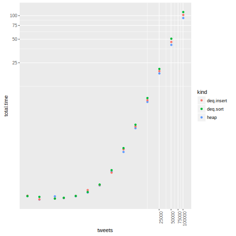

# The coding challenge.

The main source file is `src/average_degree.py` and its tests are in
`src/test_average_degree.py`.

## Language requirement

The language used is `Python`. It requires at least version `3.5` for it
to run.

## Additional libraries required.

This solution makes use of [heapdict](https://pypi.python.org/pypi/HeapDict)
module. All modules are hooked up to be installed automatically on first
invocation of related target in `make`. If any needs to be installed separately,
they can be installed with.

    make i-<module>

For example, the `heapdict` module may be installed by

    make i-heapdict

You can install all the dependencies at once.

    make prereq

The installation of python modules is setup to install to user home.
If you wish it to be installed to the system path instead, pass an empty
variable `O=` on make targets.

For example, this will automatically install the required libraries to the user
home 

    make test

This will automatically install the required libraries to the system path
(if you have access).

    make test O=

Note that all commands that require a dependency to be installed takes the
O= variable on make invocation.

We also note that one may use the standard installation procedure too e.g.

    pip3.5 install heapdict --user

## Basic invocation and tests

The `run` target executes `./run.sh` after installing prerequisite libraries in
the user home.

    make run

To execute the _insight_ test suite, (installing prerequisites in user home) use

    make test

### Unit tests

If you would like to execute unit tests without coverage, it can be done by

    make unittests

If you would like coverage information, it requires the coverage module to be
installed. (This is installed automatically as we mentioned before).

To collect branch coverage, the `unittest-branch`  target is used, followed by
extracting coverage. The project has 98% branch coverage.

    make unittest-branch
    make coverage

To collect statement coverage, the `unittest-statement` target is used, followed
by extracting coverage. The project has 99% statement coverage.

    make unittest-statement
    make coverage

### Lint

The project uses two lints: `flake8` and `pylint` (installed automatically
as we mentioned before)
The lint can be checked for both tools at once using the `lint` target

    make lint

Alternatively they can be invoked separately.

    make lint-flake8
    make lint-pylint

Type checking is preformed by the `mypy-lang` module (installed automatically
as we mentioned before), and can be invoked by

    make typecheck

### Executing the program.

To run the code on `data-gen/tweets.txt`, use

    make runit

Alternatively

    make runit TS=data-gen/tweets.txt

## Additional help

The set of targets exposed by `Makefile` can be obtained by

    make

The detailed help is provided by the `help` target

    make help

## Notes on implementation

Noticing that a large amount of tweets (95%) did not contain at least two hash
tags in `data-gen/tweets.txt`, I built an initial data pipeline using Ruby
(`bin/cleanit.rb`, `bin/online-graph.rb`) and Python for comparison
(`bin/cleanit.py`, `bin/online-graph.py`) where `bin/cleanit.*`
removed the invalid records and piped out the creation time and nodes
as records. I hoped that this would help when there are multiple CPUs. I
experimented with binary data transfer through pipes (see `rb-binary`
target of Makefile). However, on profiling, the binary transfer of time
and integer hashes of hashtags was slightly more costly (perhaps due to the
inefficient binary packing library in Ruby) than the ASCII transfer of creation
time and hashtags (see `rb-ascii` target in make file).

A problem with that approach was that even records that did not contain
more than two records needed to trigger eviction of older records. Further,
on profiling, I found that the code can easily process data at a much faster
rate than what the twitter API can provide, even if no cleanup is done before.

Hence my submission `src/average_degree.py` is a single stage application. It
expects tweets in the `stdin` and prints out the rolling average to `stdout`.
This is hooked up correctly in `run.sh` to process `./tweet_input/tweets.txt`
and output in `./tweet_output/output.txt`.

### Data structure choice

There are two possible data structures one can use. A heap, or
a dequeue kept sorted. A heap allows insertion and deletion in `O(log n)`
while for a sorted dequeue, insertion/deletion at either end is `O(1)` while
insertion or deletion in the middle may be `O(n)`. Note that we assume
a `decrease key` operation to be same as `remove + insert`.

With this in mind, the data structure with most performance is dependent on
the expected data. I have implemented both (see `deq-insert` branch for the
dequeue insertion algorithm and `deq-sort`, which is a slower (but simpler)
dequeue based implementation relying on sorting). To check which is better,
I profiled all the three

    $ head -1 data-gen/new-tweets.txt | cut -d, -f1
    {"created_at":"Sat Apr 02 20:20:41 +0000 2016"
    $ tail -1 data-gen/new-tweets.txt | cut -d, -f1
    {"created_at":"Sat Apr 02 20:53:11 +0000 2016"
    $ wc -l data-gen/new-tweets.txt 
    101436 data-gen/new-tweets.txt
    $ du -ksh data-gen/new-tweets.txt
    278M    data-gen/new-tweets.txt
    $ time make runit TS=./data-gen/new-tweets.txt > out
    
    # dequeue-insert
    100.48s user 0.77s system 98% cpu 1:43.27 total
    # dequeue-sort
    108.71s user 0.86s system 98% cpu 1:51.60 total
    # heap
    91.09s user 0.78s system 98% cpu 1:33.61 total

For the full analysis, we looked at increasing sequences of tweets
(12, 24, 59, 99, 198, 396, 792, 1584, 3169, 6339, 12679, 25359, 50718, 101436)
and plotted it. The data, and analysis is present in the `analysis` folder.

My results seem to indicate that a heap based implementation has the best
performance. Hence I have used the heap based implementation in my submission
(also in the branch `heap`).

## Notes on test generation

We generate tweets conforming to the twitter API from a template.
See `gentest` target in Makefile for help.
